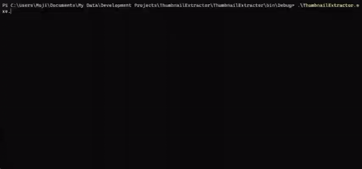

#  Thumbnail Extractor

Thumbnail Extractor is a command-line tool that automatically generates thumbnails for videos located in the root directory.

## Preview





## About the **Project**

If you happen to need to create thumbnail images for your videos, you will find this tool handy. Just put all your videos in the root directory(output folder) and simply run:

```bash
ThumbnailExtractor.exe Extract 4
```
Number 4 is the timeframe at which the thumbnail image will be extracted from.

I have also provided a few more utilities within this tool. For instance, if you want to extract a preview video out of the main video,e.g. from second 4 to second 10 of the video,
you could simply run:
```bash
ThumbnailExtractor.exe PreviewMP4 4 10
```

Another tool provided here is the mp3 preview extractor by which you extract a preview output from an mp3 sound. Just run:
```bash
ThumbnailExtractor.exe PreviewMP3 4 10 
```
And finally, you could convert your MP4 videos to MPG format by calling:
```bash
ThumbnailExtractor.exe MPG
```
MPG format comes in handy in some situations where you need to merge a couple of videos using [FFMPEG][FFMPEG Website] library.

> This project uses [NReco.VideoConverter][NRECO] library along with [FFMPEG][FFMPEG Website]. You could also easily fine-tune parameters/functionalities based on your specific need.

> For all commands except for 'Extract', you'd need to have videos in a path with no spaces in between(i.e. no space in a folder name). This is how FFMPEG library behaves.
## Installation

Just compile the project and run the ThumbnailExtractor exe file in the command line.


[FFMPEG Website]:https://ffmpeg.org/
[NRECO]:https://www.nrecosite.com/video_converter_net.aspx
